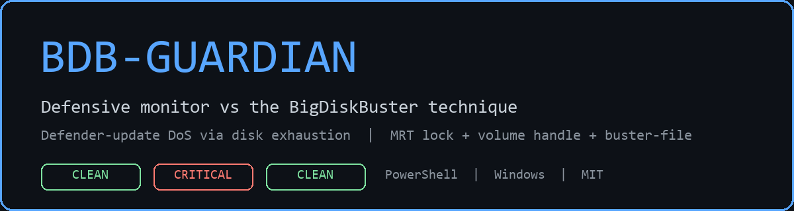
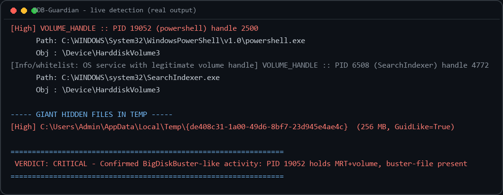
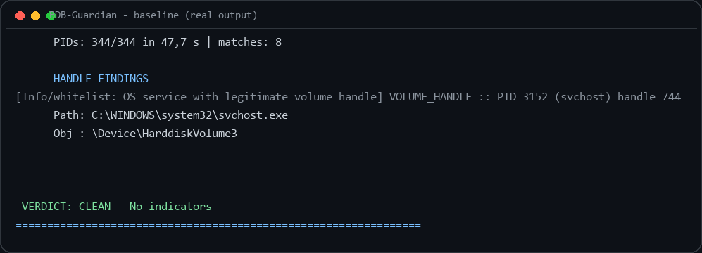

# BDB-Guardian



Defensive monitor against the **BigDiskBuster** technique: denial of service
against Windows Defender platform/signature updates via disk exhaustion.

Inspired by the analysis of [BigDiskBuster](https://github.com/MSNightmare/BigDiskBuster)
by [MSNightmare](https://github.com/MSNightmare) (MIT License).

**Live evidence report: [devcop95.github.io/BDB-Guardian](https://devcop95.github.io/BDB-Guardian/)** - responsive
page with popups, verdict cards and full captures (served from [`index.html`](index.html) via GitHub Pages).

## Authors & evidence

| | Who | Role |
|---|---|---|
|  | **[DevCop95](https://github.com/DevCop95)** | BDB-Guardian author (this repo) |
|  | **[MSNightmare](https://github.com/MSNightmare)** | Original BigDiskBuster PoC (MIT) - credited inspiration and technique source |

**Live report (GitHub Pages): open [`index.html`](index.html)** - full
evidence with console captures and JSON verdicts. To publish: push this repo
to GitHub and enable *Settings > Pages > Deploy from branch > /(root)*.

## Proof: live detection





## How BigDiskBuster works (threat model)

The PoC watches the whole `C:` volume for Defender update directories
(`ProgramData\Microsoft\Windows Defender\Platform\...` and
`...\Definition Updates\{GUID}`), locks `MRT.exe`, and the moment an update
starts it creates hidden files in `%TEMP%` with `AllocationSize` = all free
disk space (`FILE_DELETE_ON_CLOSE`), so the update fails with disk-full. When
the update gives up, it frees everything and goes back to sleep.

## What BDB-Guardian detects (3 IoCs)

| # | IoC | Method | False-positive profile |
|---|-----|--------|------------------------|
| 1 | Handle open on `C:\Windows\System32\MRT.exe` | Restart Manager (instant, exact) + name-scan backup | Very strong: nothing legit holds MRT open persistently |
| 2 | Handle open on the `C:` volume (`\Device\HarddiskVolumeN`) | Parallel native handle scan | WEAK alone (services hold it) -> OS-service whitelist, never above MEDIUM alone |
| 3 | Giant hidden file in `%TEMP%` (GUID-like name) | Directory scan | Medium (installers can look similar) |

**Verdict engine (same-PID correlation):** `MRT + volume` held by the **same
non-whitelisted PID** = `CRITICAL` (FP ~ 0); with a buster-file present it is
reported as confirmed BigDiskBuster-like activity.

## Architecture (fault isolation + crash-free interop)

```
BDBMonitor.ps1          100% managed orchestrator (cannot crash on native heap)
  +-- Invoke-VolumeScan.ps1   sacrificial child: ALL native code lives here
  |     +-- bdb-csharp.ps1    RestartManager / NtQuerySystemInformation /
  |                           DuplicateHandle / NtQueryObject (inline C#)
  +-- verdict + JSON report
```

Hardened with documented root causes (researched on forums/SO):

- `RmGetList` writes **`RM_PROCESS_INFO`** (~668 bytes/entry), not
  `RM_UNIQUE_PROCESS`. Passing the small struct overflows the heap
  (`0xC0000374`) - this was our crash. Every reference implementation
  (MSDN, Roslyn `FileLockCheck`, ironman) uses `RM_PROCESS_INFO` + retry loop.
- Name queries skip non-disk handles (`GetFileType != DISK`, pipes hang
  `NtQueryObject`), per-PID timeouts as backstop. Bonus: full scan went from
  ~45 s to ~6-14 s.
- If the worker ever dies, the monitor survives and reports degraded mode.

Stability proven: repeated full runs with live IoCs, zero `Application Error`
events, consecutive `CRITICAL` verdicts (see `captures/stability-run*.log`).

## Files

- `BDBMonitor.ps1` - the monitor. `-TempSizeThresholdMB` (def. 1024),
  `-MaxScanSeconds` (def. 70), `-LogDir`, `-ConsoleLogPath`.
- `Invoke-VolumeScan.ps1` + `bdb-csharp.ps1` - sacrificial scan worker.
- `Invoke-BDBSimulation.ps1` - SAFE IoC simulator for testing (controlled
  256 MB file, releases everything, verifies cleanup). Never fills the disk.
- `launch-sim.ps1` - launches the simulator via WMI (detached).
- `captures/` - evidence logs (console transcripts + JSON reports).
- `docs/` - banners rendered from real outputs (`render-banners.py`).
- `index.html` - standalone evidence report (GitHub Pages ready).

## Tested (Windows 11, admin PowerShell 5.1)

- Baseline (idle system): `CLEAN`, legit volume holders correctly whitelisted.
- Live simulation (MRT + volume + 256 MB buster-file): `CRITICAL -
  Confirmed BigDiskBuster-like activity: PID xxxx holds MRT+volume,
  buster-file present` (repeated, stable).
- Post-simulation: `CLEAN`, verified no leftovers.

Requires Administrator (to enumerate handles of SYSTEM/protected processes).
